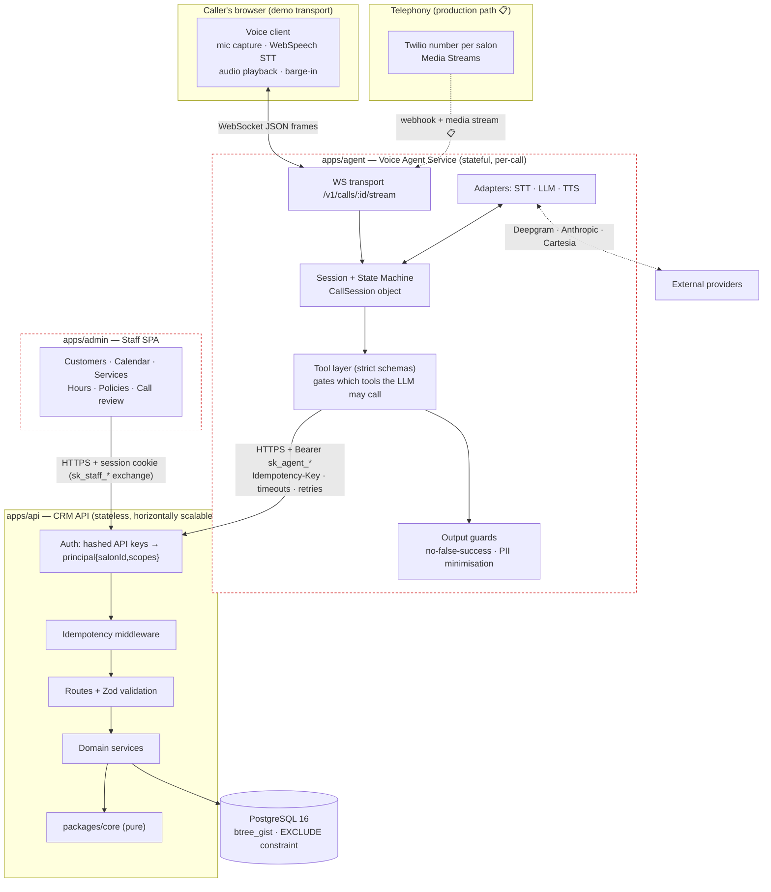
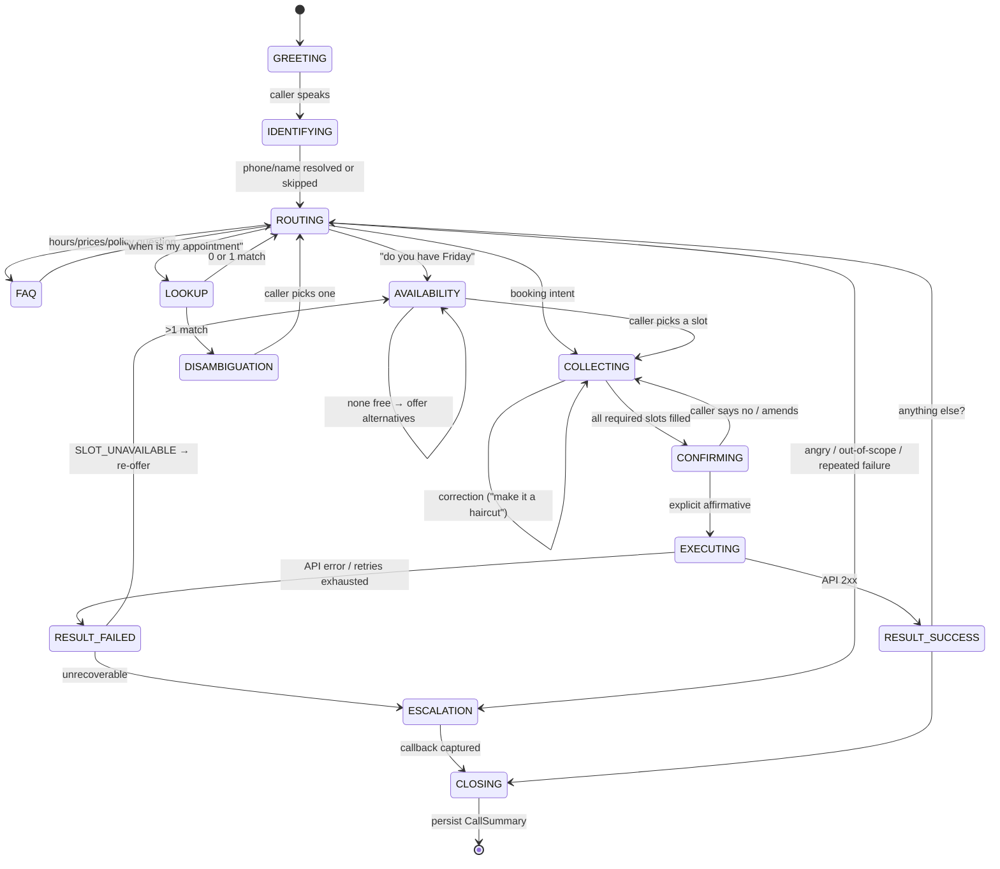

# Architecture — Salon Voice AI Receptionist + CRM

> Source of truth for design decisions. Updated whenever a decision changes.
> Status legend: ✅ implemented · 🟡 partial//scaffolded · 📋 documented-only (production path)

---

## 0. Stack (final choices)

| Layer | Choice | Rationale |
|---|---|---|
| Language | **TypeScript** (Node 24, ESM, `strict`) | One language across API, agent, and UI means the Zod request/response schemas in `packages/contracts` are literally the same objects the agent validates against and the UI's types derive from. A Python API would force a hand-maintained second copy of the contract — the exact thing that rots. |
| API framework | **Fastify 5** | Schema-first by design (JSON-Schema per route → validation + OpenAPI generation for free), ~2× Express throughput, first-class async error handling, mature plugin scoping for auth/rate-limit hook points. |
| Database | **PostgreSQL 16** | The correctness core of this system is "two calls must not book the same slot." Postgres gives that as a *database-level* `EXCLUDE USING gist` constraint over `tstzrange`, plus real transactions for atomic reschedule and `ON CONFLICT` for idempotency-key reservation. This is not a preference; it is the reason the concurrency requirement is satisfiable without a distributed lock service. |
| Query layer | **Drizzle ORM** | Typed queries inferred from a TS schema, no codegen daemon, no runtime engine binary. Thin enough that dropping to raw SQL for the tricky queries is normal rather than an escape hatch. |
| Migrations | **Hand-authored numbered SQL** + tiny runner (`apps/api/src/db/migrate.ts`, tracked in `schema_migrations`) | Deliberate deviation from `drizzle-kit generate`. The schema depends on `EXCLUDE USING gist (... WITH &&) WHERE (...)`, `btree_gist`, partial indexes, and check constraints that no ORM diff tool round-trips faithfully. Reviewable SQL is worth more here than generated SQL. Drizzle is still the source of truth for *query types*; a test asserts the TS schema and the SQL agree. |
| Validation / contract | **Zod** → JSON-Schema → OpenAPI | Single declaration produces runtime validation, static types, and the published spec. |
| Admin UI | **React 18 + Vite + TanStack Query** | Server-state caching, retries, and optimistic-update rollback are what a CRM UI actually needs; hand-rolling that is where prototype UIs go wrong. Plain CSS — functional over polished, as scoped. |
| Voice transport | **WebSocket + browser client**, provider-abstracted pipeline | See §6. Twilio phone numbers are the documented production path (📋), browser is the live demo path (✅). |
| LLM | **Anthropic Claude** (`claude-opus-5`, adaptive thinking at `low` effort), pluggable | Strict tool schemas (`strict: true`) mean tool input always validates, so the executor never receives a half-formed booking. Low effort keeps turn latency down for voice; *disabling* thinking is worse than it sounds — it risks the model writing a tool call into visible text, which on a phone call means reading JSON to a customer while nothing gets booked. A `scripted` adapter makes the conversation flows deterministically testable with no API key. |
| STT | **Deepgram** streaming (✅ adapter) · **browser WebSpeech** (✅ zero-key demo) · `mock` (tests) | |
| TTS | **Cartesia** / **ElevenLabs** (✅ adapters) · **browser SpeechSynthesis** (✅ zero-key demo) · `mock` | |
| Logging | **pino** JSON + AsyncLocalStorage correlation | |
| Tests | **Vitest** + **Testcontainers-style ephemeral PG** | Integration tests run against a real Postgres, because the constraints being tested are Postgres features. Mocking the DB would test nothing. |
| Monorepo | **pnpm workspaces** | |

### Repository layout

```
.
├── packages/
│   ├── contracts/     Zod schemas, error codes, shared DTOs. Depended on by api, agent, admin.
│   └── core/          Pure domain logic. Zero I/O, zero imports from api/db. Availability
│                      engine, policy evaluation, fuzzy-time resolution, slot math.
├── apps/
│   ├── api/           CRM API. The ONLY process with database credentials.
│   ├── agent/         Voice agent service + browser voice client. Talks to api over HTTP only.
│   └── admin/         Staff SPA. Talks to api over HTTP only.
└── docs/              openapi.json (generated)
```

`packages/core` being I/O-free is load-bearing: the availability engine and every policy rule are unit-testable as pure functions over plain data, and the same functions the API uses to *produce* slots are used to *validate* a booking. There is one implementation of "is this slot legal," not two that can drift.

---

## 1. System diagram



**The one boundary that matters:** `apps/agent` and `apps/admin` have no database driver in their dependency tree and no `DATABASE_URL` in their environment. This is enforced mechanically, not by convention — `pnpm test:boundaries` fails the build if either package resolves `pg`, `drizzle-orm`, or imports from `apps/api/src`. The voice agent is a *client* of the CRM, indistinguishable from any third-party integration, which is what makes the CRM API's contract real rather than aspirational.

---

## 2. Data model

```mermaid
erDiagram
    SALON ||--o{ BUSINESS_HOURS : "opening times"
    SALON ||--o{ CLOSED_DATE : "holiday overrides"
    SALON ||--o{ SERVICE : offers
    SALON ||--o{ STAFF_MEMBER : employs
    SALON ||--o{ CUSTOMER : has
    SALON ||--o{ APPOINTMENT : schedules
    SALON ||--|| BOOKING_POLICY : "governed by"
    SALON ||--o{ CALL_LOG : receives
    SALON ||--o{ API_KEY : authorises
    SALON ||--o{ IDEMPOTENCY_KEY : scopes

    STAFF_MEMBER ||--o{ STAFF_SERVICE : "can perform"
    SERVICE      ||--o{ STAFF_SERVICE : "performed by"
    STAFF_MEMBER ||--o{ STAFF_WORKING_HOURS : "works"
    STAFF_MEMBER ||--o{ APPOINTMENT : "assigned to"
    SERVICE      ||--o{ APPOINTMENT : "booked as"
    CUSTOMER     ||--o{ APPOINTMENT : books
    CALL_LOG     ||--|| CALL_SUMMARY : "summarised by"
    CALL_LOG     ||--o{ APPOINTMENT : "originated"
    APPOINTMENT  ||--o| APPOINTMENT : "rescheduled_to"

    SALON {
        uuid id PK
        text name
        text timezone "IANA, e.g. Europe/London"
        text phone
        text email
        timestamptz created_at
    }
    BUSINESS_HOURS {
        uuid id PK
        uuid salon_id FK
        int day_of_week "0=Sun..6=Sat"
        time open_time "salon-local wall clock"
        time close_time
        bool is_closed
    }
    CLOSED_DATE {
        uuid id PK
        uuid salon_id FK
        date date
        text reason
        time open_time "NULL = closed all day"
        time close_time "non-NULL pair = special hours"
    }
    SERVICE {
        uuid id PK
        uuid salon_id FK
        text name
        text description
        text category
        int duration_minutes
        int buffer_before_minutes
        int buffer_after_minutes
        numeric price
        text currency
        bool active
    }
    STAFF_MEMBER {
        uuid id PK
        uuid salon_id FK
        text name
        text role
        bool is_default_resource
        bool active
    }
    STAFF_WORKING_HOURS {
        uuid id PK
        uuid staff_id FK
        int day_of_week
        time start_time
        time end_time
    }
    CUSTOMER {
        uuid id PK
        uuid salon_id FK
        text first_name
        text last_name
        text phone "E.164, UNIQUE per salon"
        text email
        text notes "staff-only, never voiced"
        timestamptz created_at
        timestamptz updated_at
    }
    APPOINTMENT {
        uuid id PK
        uuid salon_id FK
        uuid customer_id FK
        uuid service_id FK
        uuid staff_id FK "NOT NULL — always resolved"
        timestamptz start_time
        timestamptz end_time
        timestamptz block_start "incl. buffer_before"
        timestamptz block_end "incl. buffer_after"
        text status "booked|cancelled|completed|no_show|rescheduled"
        text source "voice|staff|web"
        uuid call_id FK "nullable"
        uuid rescheduled_to_id FK "nullable"
        numeric price_at_booking
        text cancellation_reason
        timestamptz created_at
        timestamptz updated_at
    }
    BOOKING_POLICY {
        uuid salon_id PK
        int min_lead_minutes
        int max_advance_days
        int cancellation_window_hours
        numeric late_cancellation_fee
        int slot_granularity_minutes
        bool allow_double_booking
        int no_show_fee
        int max_active_per_customer
    }
    CALL_LOG {
        uuid id PK
        uuid salon_id FK
        text caller_phone
        timestamptz started_at
        timestamptz ended_at
        text transport "browser|twilio|test"
        text status "in_progress|completed|failed"
        jsonb transcript "ordered turns"
        text recording_ref
    }
    CALL_SUMMARY {
        uuid id PK
        uuid call_id FK "UNIQUE"
        uuid salon_id FK
        uuid customer_id FK "nullable = unknown caller"
        text_array intents
        text_array services_discussed
        text appointment_action "book|cancel|reschedule|none"
        text action_result "success|failed|not_attempted"
        text failure_reason
        uuid appointment_id FK "nullable"
        text summary
        jsonb key_entities
        jsonb events "tool calls, confirmations, errors"
        bool escalated
        text escalation_reason
        jsonb callback_request "name, phone, reason, preferred window"
    }
    IDEMPOTENCY_KEY {
        uuid salon_id PK
        text key PK
        text endpoint
        text request_hash
        text status "in_progress|completed"
        int response_status
        jsonb response_body
        timestamptz created_at
        timestamptz expires_at
    }
    API_KEY {
        uuid id PK
        uuid salon_id FK
        text name
        text key_hash "sha256, raw key never stored"
        text_array scopes
        timestamptz revoked_at
    }
```



### Decisions worth defending

**`appointment.staff_id` is NOT NULL.** A caller may say "anyone's fine," but the *system* always commits to a concrete resource before writing. This is what makes the overlap guarantee a database constraint instead of application-level capacity arithmetic. Salons that don't track individual stylists get one seeded `is_default_resource` staff row representing the chair; nothing else in the model changes. The alternative — nullable staff plus a counting check — cannot be expressed as an exclusion constraint and would degrade to `SELECT count(*) … FOR UPDATE` over a range, which is both slower and race-prone across serialisation anomalies.

**`block_start`/`block_end` are stored, not generated.** Buffers live on `service`, but the exclusion constraint must operate on a single row's columns. `GENERATED ALWAYS AS (start_time - make_interval(...))` is rejected by Postgres because `timestamptz - interval` is STABLE (DST-dependent), not IMMUTABLE. So the application computes the blocked range and a `CHECK (block_start <= start_time AND start_time < end_time AND end_time <= block_end)` keeps it honest.

**All instants are `timestamptz` (stored UTC); all *rules* are salon-local wall clock.** Business hours, closed dates and staff hours are `time`/`date` without zone, interpreted in `salon.timezone` via Luxon at the boundary. Storing "10:00 opening" as UTC would silently break twice a year at DST transitions. Conversion happens in exactly one module (`packages/core/src/time`).

**Overlap prevention:**
```sql
CREATE EXTENSION IF NOT EXISTS btree_gist;
ALTER TABLE appointments ADD CONSTRAINT appointments_no_overlap
  EXCLUDE USING gist (
    salon_id  WITH =,
    staff_id  WITH =,
    tstzrange(block_start, block_end) WITH &&
  ) WHERE (status IN ('booked', 'completed'));
```
`cancelled`, `no_show` and `rescheduled` rows leave the constraint's predicate, which is precisely why an atomic reschedule works: within one transaction we set the old row to `rescheduled` (it exits the index) and insert the new row (no self-conflict). No check-then-write window exists — the write *is* the check, and a violation surfaces as SQLSTATE `23P01`, which the service layer maps to `SLOT_UNAVAILABLE`.

**Indexes:** `(salon_id, start_time)` for calendar range scans and availability loads; `(salon_id, customer_id, start_time DESC)` for "my appointments"; unique `(salon_id, phone)` on customers; GiST index implied by the exclusion constraint; `(salon_id, expires_at)` on idempotency keys for sweeping.

---

## 3. API design

Versioned under `/v1`. Full reference with examples in [`API.md`](./API.md); machine-readable spec at `docs/openapi.json`.

**`salon_id` is never accepted from a request body or path.** It is derived from the authenticated principal. A compromised or buggy agent cannot read or write another salon's data by changing a parameter, and multi-tenancy therefore cannot be broken by a forgotten `WHERE` clause in a route — every repository function takes `salonId` as its first argument from the principal.

### Error contract

Every non-2xx response is exactly:
```json
{ "error": { "code": "SLOT_UNAVAILABLE", "message": "That time was just taken.",
             "details": { "requestedStart": "...", "alternatives": [...] },
             "requestId": "req_..." } }
```
`code` is a closed enum in `packages/contracts` shared by server and agent, so the agent branches on codes and never parses prose. Notably `CANCELLATION_WINDOW_PASSED` returns `details.windowHours`, `details.hoursUntilAppointment` and `details.feeApplies` — the endpoint refuses the free cancellation but hands back everything needed to explain the situation to the caller and offer the fee-bearing option, rather than a bare rejection.

### Idempotency

`POST /v1/appointments`, `/v1/appointments/:id/cancel`, `/v1/appointments/:id/reschedule` require `Idempotency-Key`.

```mermaid
sequenceDiagram
    participant A as Agent
    participant M as Idempotency middleware
    participant H as Handler
    participant D as Postgres
    A->>M: POST + Idempotency-Key: k
    M->>D: TX1 INSERT (salon,k,hash,'in_progress') ON CONFLICT DO NOTHING; COMMIT
    alt row inserted (we own it)
        M->>H: execute
        H->>D: TX2 business transaction
        M->>D: TX3 UPDATE → 'completed' + response
        M-->>A: 201 (Idempotent-Replay: false)
    else key exists, same request hash, completed
        M-->>A: stored status + body (Idempotent-Replay: true)
    else key exists, same hash, in_progress
        M-->>A: 409 IDEMPOTENCY_REQUEST_IN_PROGRESS  → agent backs off and retries
    else key exists, different request hash
        M-->>A: 422 IDEMPOTENCY_KEY_REUSED
    end
```
The reservation must commit *before* the handler runs — otherwise a concurrent retry sees no row (uncommitted inserts are invisible) and both requests execute. A stale `in_progress` older than `IDEMPOTENCY_STALE_SECONDS` (default 60) may be taken over, so a crashed request cannot wedge a key forever.

### Availability

`GET /v1/availability` accepts either an explicit `from`/`to` window **or** a `timeExpression` such as `"next friday afternoon"` plus the salon timezone, resolved server-side by the same deterministic resolver the agent uses. Returns bookable slots honouring business hours, closed dates, staff working hours, per-staff existing bookings including buffers, min-lead-time and max-advance-window. When zero slots match, it returns `alternatives` — the nearest N bookable slots outside the requested window — so "that's not available" is never a dead end for the caller.

---

## 4. Conversation architecture

An **agent-with-tools loop wrapped in an explicit state machine**. The LLM chooses *what to say* and *which tool to ask for*; the state machine decides *which tools exist* at that moment. Guardrails are structural, not prompt-dependent.



### Six structural guarantees

**1. Write tools do not exist before confirmation.** The tool list handed to the LLM is computed per turn from `session.state`. In `COLLECTING`, the model can call `propose_booking` — which only *stages* a `pendingConfirmation` and returns the restatement text. `commit_pending_action` is absent from the tool array entirely until `state === CONFIRMING` **and** `pendingConfirmation` exists. The model cannot book without confirming, because at that moment there is no function to call. A prompt saying "always confirm first" is a request; an absent tool is a guarantee. It is also the one tool that changes data, and it takes **no booking details** — it performs exactly the payload that was staged and read aloud, so a drifted conversation cannot alter what gets written.

**2. A staged action survives only an unqualified yes.** Before the model sees a turn, the orchestrator classifies the caller's words (`agent/confirmation.ts`). Anything that is not a clear acceptance — a correction, a new topic, a question, silence — discards the `pendingConfirmation`, returns to `COLLECTING`, and records the discard in the call trail. The agent must then propose again, minting a fresh idempotency key.

The classifier is deliberately asymmetric: a sentence containing both an acceptance and a correction ("yes, but can we make it Friday instead") counts as a correction. Re-proposing costs the caller one sentence; committing something they did not agree to cancels the wrong appointment.

**2b. The state gate is enforced at execution, not merely advertised.** Computing a reduced tool list is only a guarantee if calling something outside it is refused, so the orchestrator checks each requested tool against the list actually offered that turn and returns a tool-level error otherwise. Without this, a model that ignores its tool list — or a regression in how the list is built — walks straight past guarantee 1.

**3. The agent cannot claim success the API didn't return.** After a write, the outcome is recorded on the session by the *tool layer* from the HTTP status — not inferred from model text. An output guard runs on every agent utterance: if `session.lastWriteOutcome` is `failed`/`unknown` and the utterance matches success language (`/\b(booked|confirmed|all set|you're down for|cancelled)\b/i` without a negation), the utterance is suppressed and replaced with a templated honest response naming the actual error code. This is tested directly by forcing the API to 500.

**4. Ambiguity is never resolved by guessing.** `find_appointments` returning ≥2 rows sets `state = DISAMBIGUATION` and returns a result object with `requiresDisambiguation: true` and no single `appointmentId`. `propose_cancellation`, `propose_reschedule` and `select_appointment` all hard-refuse (tool-level error, not model discretion) unless given an `appointmentId` drawn from the candidate list — an id from anywhere else would let the agent act on a stranger's booking.

Resolving the ambiguity is its own recorded step. `select_appointment` writes the caller's choice onto the session, narrows `candidates` to the one they picked, and leaves a `state_changed` entry in the call trail. The chosen id is then restated in the prompt's state block on every subsequent turn, so it survives a truncated or summarised history — the appointment the agent is about to cancel is exactly the thing that must not be lost from context.

**5. A conversation that stops progressing is escalated, not repeated.** Each turn is fingerprinted by its state plus the tools it called. Three identical turns in a row means the caller is being asked the same question over and over while nothing changes — the failure mode a fluent agent hides best, because every individual reply reads as reasonable. The agent offers a callback instead of continuing, and the trip is recorded as `conversation_stalled`. There is a companion guard *within* a turn: a model that answers a tool result by requesting the same tool again ends the turn rather than burning the round limit in silence.

### Session state

Session state is an explicit object, not prompt history. Prompt history is a *rendering* of it.

```ts
interface CallSession {
  callId: string; salonId: string; callerPhone: string | null;
  state: ConversationState;
  customer: { id: string; firstName: string } | null;   // minimum PII, see §7
  intents: Intent[];
  slots: { serviceId?, serviceName?, staffId?, requestedWindow?, chosenSlot?, appointmentId? };
  candidates: AppointmentCandidate[];                   // for DISAMBIGUATION
  pendingConfirmation: { action; payload; idempotencyKey; restatement } | null;
  lastWriteOutcome: { action; result: 'success'|'failed'|'unknown'; code?; appointmentId? } | null;
  toolCalls: ToolCallRecord[];                          // audit → CallSummary.events
  transcript: Turn[];
  consecutiveFailures: number;
  escalation: { reason; callback? } | null;
}
```
Each turn: append user turn → recompute allowed tools from `state` → render system prompt with *current session facts* (not raw history replay) + recent turns → LLM → tool calls execute through the tool layer (which mutates session and appends `ToolCallRecord`) → loop until text response → output guard → TTS. Because the durable facts live on the session, a truncated or summarised history cannot lose the appointment ID the agent is about to cancel.

**Fuzzy time is resolved by code, not the model.** `packages/core/src/time/resolveExpression.ts` turns "next friday afternoon", "a week from tuesday", "sometime after 3" into a concrete `{start, end}` window in salon time. The LLM's job is only to *extract the phrase*; the arithmetic is deterministic and unit-tested, because an LLM quietly getting "next Friday" wrong during a DST week is a class of bug that never shows up in review.

### Reliability at the agent boundary

Every CRM call: 8 s timeout, 2 retries, exponential backoff with jitter, retry only on timeout/5xx/429/`IDEMPOTENCY_REQUEST_IN_PROGRESS`. Writes always reuse the idempotency key minted when the action was staged, so a slow-but-successful first attempt replays instead of duplicating. Exhausted retries → `RESULT_FAILED` → honest message → callback capture. LLM/STT/TTS calls have their own timeouts with degradation: TTS failure falls back to browser speech synthesis; LLM failure yields a templated holding response and one retry before escalation. Nothing in the pipeline can hang a call indefinitely.

---

## 5. Structured call results

Every call persists a `CallLog` (opened at call start) and exactly one `CallSummary`, **written incrementally after every turn and finalised in a `finally` block**.

Writing only at the end was not enough, and live use proved it twice over. A caller who books and then simply leaves the line open is invisible to the salon: their appointments appear in the diary with no call behind them. And a call that is never cleanly hung up — the tab closed, the laptop shut, a worker restarted — left nothing but an empty row with a zero-length transcript, which is precisely the call worth reading. Persisting each turn means a call in progress is reviewable *while it is in progress*, and an abandoned one is complete up to its last turn. The write happens after the caller has been answered and is deliberately fire-and-forget: bookkeeping must never interrupt a conversation, and a failed write simply retries on the next turn. The summary carries detected intents, services discussed, the attempted action and its real result, confirmed appointment details, a natural-language summary, the structured event list (tool calls with latency and outcome, confirmations, errors), and any escalation/callback payload. Surfaced at `GET /v1/call-summaries` and in the CRM UI's review screen with a filter for `escalated=true`.

---

## 6. Voice transport

The demo runs **browser ↔ agent over WebSocket**, which exercises the entire pipeline — real microphone, real speech recognition, real barge-in, real synthesized speech — with no telephony account required. Provider adapters are the seam:

| Role | Zero-key demo | Production adapter |
|---|---|---|
| STT | Browser WebSpeech (continuous, interim results) | Deepgram streaming over server WS |
| TTS | Browser SpeechSynthesis | Cartesia / ElevenLabs streamed to client |
| LLM | `scripted` (tests) | Anthropic Claude tool-calling |

**Barge-in.** The client emits `barge_in` on interim STT results arriving while agent audio is playing; the server cancels in-flight TTS, truncates the agent turn at the spoken prefix, and returns the floor to the caller. With Twilio Media Streams the same signal comes from server-side VAD on the inbound µ-law frames; the session logic is transport-independent because it consumes a normalised `TransportEvent` stream.

**Telephony (📋).** `POST /twilio/voice` returns TwiML opening a bidirectional Media Stream to `WSS /twilio/stream`; that handler transcodes µ-law 8 kHz ↔ PCM and emits the same `TransportEvent`s the browser client produces. Implemented to the interface, unverified without an account — stated plainly rather than claimed.

---

## 7. Security, privacy, observability

- Secrets via `.env` (`.env.example` committed, real values never). API keys stored as SHA-256 hashes; the raw key is shown once at seed time.
- Two credential classes with independent scopes and revocation: `sk_agent_*` (`services:read`, `availability:read`, `customers:read`, `customers:write`, `appointments:*`, `calls:write`) and `sk_staff_*` (full, including `policies:write`, `hours:write`, `calls:read`). The agent key deliberately lacks `customers:read:full` — see below.
- **PII minimisation is enforced by the serializer, not by prompt instruction.** Customer objects returned to an agent-scoped principal pass through a projection that drops `notes`, `email`, `lastName` and unrelated appointment history. The voice agent is structurally incapable of reciting a customer's staff notes because it never receives them.
- Log redaction: pino `redact` on phone/email/notes paths; phone numbers appear as `+4479••••1234`. Logs carry `request_id`, `call_id`, `salon_id`, never raw PII.
- Structured JSON logs correlated end-to-end: one `call_id` reconstructs agent turns → tool calls (with latency + outcome) → API requests → DB writes.
- Rate limiting: `@fastify/rate-limit` registered with a per-principal key generator, permissive by default in dev — the hook point exists and is configured, tightening is a config change.
- 📋 Production: OpenTelemetry traces spanning agent→API→DB; metrics on booking success rate, availability p95, escalation rate, tool-call error rate, false-success-guard trips (should be 0 — any non-zero is a page); alerts on booking success rate dip and escalation rate spike.

---

## 8. Assumptions

Ambiguous requirements, resolved and recorded rather than silently decided:

1. **Browser voice is the demo transport**; Twilio is documented and coded to the interface but unverified without an account. The prompt explicitly permits this.
2. **One service per appointment.** The model supports multi-service via a join table extension, but the booking flow, availability engine and voice confirmation are single-service. Documented in `SCALING.md` as the first schema extension.
3. **Staff is always resolved before write** (see §2). "Anyone" means the engine picks the least-loaded qualified staff member, not that the row is unassigned.
4. **Customer identity is phone-based**, unique per salon, E.164-normalised. Two people sharing a phone are one customer record; a real deployment would add a household/member concept.
5. **No payment processing.** Cancellation and no-show fees are recorded as amounts owed on the appointment; charging them is out of scope.
6. **Cancellation inside the window is permitted with a fee**, not refused, when `late_cancellation_fee` is set — the agent must disclose the fee and get confirmation. A hard refusal is a policy flag away.
7. **Salon-local wall clock governs all rules**; DST transitions are handled by Luxon at the conversion boundary. Appointments spanning a DST jump are computed from local start + duration.
8. **The caller's phone number is trusted for lookup but not for authorisation.** Anyone calling from a known number can see and modify that customer's appointments — the same trust model as a human receptionist with caller ID. A production deployment handling sensitive services should add a verification step; noted, not implemented.
9. **`GET` endpoints are not idempotency-keyed** (naturally idempotent); only the three state-changing appointment endpoints require keys.
10. **Recording storage is referenced, not implemented.** `call_log.recording_ref` holds an object-storage URI; no audio is persisted in the prototype, which also keeps the prototype clear of two-party-consent recording law.

---

## 9. Phase status

| Phase | Scope | Status |
|---|---|---|
| 0 | Scaffold, tooling, env, CI-style scripts, boundary fitness function | ✅ |
| 1 | Data model, migrations, seed (two salons, config-only onboarding proven) | ✅ |
| 2 | CRM API — 35 operations, auth, scopes, idempotency, error contract, OpenAPI | ✅ |
| 3 | Admin UI — diary, customers, services, hours, policy, call review | ✅ |
| 4 | Voice agent — state machine, tool layer, guards, browser voice client | ✅ |
| 5 | Reliability — idempotent retries, concurrency, timeouts, confirmation gating | ✅ |
| 6 | Call outcomes, observability, 167 tests, docs | ✅ |

**Test coverage:** 88 unit (pure domain engine) · 60 integration (real PostgreSQL, including an
eight-way concurrent booking race and schema-drift reflection) · 93 conversation and confirmation
(full agent over real HTTP against a fault-injecting CRM, including regressions for every loop,
mis-commit, stale-state failure and mis-answered question found in live use). `pnpm check` runs lint, typecheck, boundaries and all
of them.

## 10. Decisions taken during implementation

Changes to the design above, made while building and worth recording:

1. **`appointments.overbooked`.** The brief asks for configurable double-booking rules, but a
   blanket exclusion constraint forbids them. Rather than weaken the constraint for everyone, a
   row may be flagged `overbooked` and is then exempt from its predicate. Setting the flag needs
   the `appointments:overbook` scope *and* a salon policy that allows it — the voice agent has
   neither, so "squeeze someone in" stays a deliberate human act.

2. **Caller-ID lookup at call start.** `CallRunner.start` resolves the caller from the number
   they are ringing on before the first word, exactly as a receptionist's screen would. A
   returning customer is greeted by name and does not have to re-give details already on file.

3. **Instants are canonicalised on entry to the domain engine.** Comparing ISO strings
   lexicographically is only sound when they share one rendering — `"…10:15:00.000Z"` sorts
   *before* `"…10:15:00Z"`, the same instant. A unit test caught this producing phantom booking
   conflicts. Every instant entering the engine now passes through `canonicalInstant`, and
   overlap tests compare epoch milliseconds.

4. **`commit_pending_action` takes no booking details.** The payload is frozen when the action
   is staged and read back to the caller, so the agent commits precisely what was agreed even if
   the conversation has drifted since. The confirmation gate is not just "did they say yes" but
   "yes to *this*".

5. **A `TIMEOUT` on a write yields `unknown`, never `failed`.** The write may have landed. The
   agent is required to say it cannot confirm, rather than telling a customer their booking
   failed when it may have succeeded — a distinction with real consequences at the salon door.

6. **A repeated-identical-tool-call guard.** A model that answers every tool result by
   requesting the same tool again would leave a caller listening to silence until the round
   limit expired. The turn now ends instead, and the trip is recorded.

7. **`select_appointment`, and appointment ids in the prompt.** Found by a live session: the
   agent asked "which one did you mean?", the caller said "the first one", and nothing handled
   the answer — so it fell through to a generic greeting and asked again, indefinitely. Two
   things were wrong underneath the immediate bug. Resolving an ambiguity was an implicit step
   the model was expected to carry in its head, so nothing recorded it and nothing could act on
   it a turn later; and the state block listed the candidate appointments *without their ids*,
   leaving the agent to dig them out of conversation history — the one part of the context that
   gets truncated. Both are fixed: the choice is now an explicit tool call, and the ids live in
   the durable half of the context.

8. **A cross-turn stall guard.** The same live session showed `find_appointments` running four
   times across four turns with no progress and nothing noticing. The within-turn repetition
   guard could not see it, because each turn was individually well-formed. Stalls are now
   detected across turns and escalated to a human.

   It fingerprints *progress* — who we are talking about, which service, which appointment,
   what is staged, whether a write landed — rather than the shape of the turn. A first attempt
   compared consecutive turns and missed the loop that actually occurred in practice, where the
   agent alternated between reading the service menu and giving a generic reply: no two
   consecutive turns looked alike while the conversation went nowhere at all.

9. **A staged action outliving the caller's agreement.** The worst bug found in this project,
   reported from a live session and reproduced immediately: the caller staged a cancellation,
   said *"actually no, I want to move it instead"*, and the staging survived — so a later "yes",
   to an entirely different question, cancelled the appointment they had just said they wanted
   to keep.

   The documentation above had claimed since the first draft that "any correction invalidates
   the staged key". It was never implemented; the only place `pendingConfirmation` was cleared
   was after a *successful* commit. The prompt asked the model to re-propose, and the model
   usually did — which is exactly how a missing structural guarantee hides. Guarantee 2 is now
   real, enforced in the orchestrator, and covered by regression tests.

11. **A completed write invalidates everything cached about the diary.** Reported live: the
    caller cancelled one appointment, then asked to move another, and every attempt failed. The
    session still held the *cancelled* appointment in `candidates` and its service in `slots`, so
    the agent proposed moving something that no longer existed — and, once that was fixed,
    searched availability using the wrong service and was offered a stylist who could not perform
    the one actually being moved. A successful write now clears the cached view and re-points it
    at whatever the write produced. Cached reads of a thing you just changed are stale by
    definition.

12. **A staged action is kept only while retrying it could work.** Idempotent retry is the right
    behaviour for a timeout or a 5xx — and exactly the wrong behaviour for a definitive refusal,
    which will fail identically forever. Keeping it produced a loop in live use: the appointment
    was gone, every retry failed, and the caller heard "shall I go ahead?" indefinitely. The
    staging now survives only a retryable failure.

13. **The commit tool follows the staged action, not the state name.** A failed write leaves the
    state at `RESULT_FAILED` with the action still staged, but the tool list only offered
    `commit_pending_action` in `CONFIRMING` — so the retry the reliability design depends on was
    unreachable. Gating now follows `pendingConfirmation`, which is strictly stronger since
    guarantee 2 clears it on any non-affirmative turn. A proposal also cannot be committed in the
    turn it was made: the caller has not heard the restatement yet.

14. **Substring matching is not matching.** Service names were matched as substrings, so
    "I would like to book an **appoint·men·t**" silently resolved to "Men's Cut". The agent then
    asked when they wanted their men's cut and every later turn disagreed with itself — the kind
    of failure that reads as vagueness rather than as a bug. Matching is now on whole words, with
    plural tolerance narrow enough that "like **to** book" no longer finds "**To**uch-Up".

22. **A record that only exists once the call ends is not a record.** Reported live: two
    appointments booked and visible in the diary, with no call anywhere in the CRM. The summary
    and transcript were written only by `end()`, so a caller who never hangs up produced an empty
    `call_logs` row — and an abruptly closed tab lost the transcript entirely. Both are now
    written after every turn: a call on the line shows in the review screen as it happens, and an
    abandoned one is complete to its last turn. The claim in §5 that abandoned calls were already
    recorded had been true only of a *clean* WebSocket close, which is not what abandonment looks
    like in practice.

19. **A spoken time is a local time.** Reported live: the caller asked for
    "Wednesday 9:30 a.m.", was offered 9:30, and the agent proposed 10:30. Offered slots carry
    `start` as a UTC instant, and the matcher compared the caller's spoken *local* time against
    that raw string — under British Summer Time the 10:30 slot's instant is `T09:30`. Exactly one
    hour out, only during BST, and invisible in a December demo. Slots now carry `localTime`
    (which the API already computed for precisely this reason) and every spoken time is matched
    against it. A bare hour has two readings — "half two" is 02:30 or 14:30 — and the one nearer
    the times already under discussion wins, because context disambiguates better than any rule
    about mornings.

20. **Offer only what you say out loud.** The engine returned six slots and the agent read three,
    so "the third one" indexed a time the caller had never heard. Spoken and selectable are now
    the same set. A time named but *not* offered is searched for rather than refused — only three
    of the free slots were spoken, so "ten o'clock" may well be available.

21. **Contention is not a definitive answer.** The eight-way race test failed intermittently: a
    loser received an untyped `INTERNAL_ERROR`. Concurrent bookings of one slot serialise in the
    database, and under load that surfaces as a deadlock, a lock timeout, or an exhausted
    connection pool — none of which mean "that time is taken", and all of which were falling
    through to a bare 500 the agent could not act on. They now map to a typed, retryable
    `SERVICE_UNAVAILABLE`, and the pool is sized to exceed same-slot concurrency (a blocked
    INSERT holds its connection while it waits). The test now pins the invariant that actually
    matters: exactly one winner, and no loser ever gets an untyped error.

15. **What the caller is trying to do is state, not an inference.** "The first one" means a slot
    to book or a slot to move to, depending entirely on intent — and inferring that from whether
    an appointment id happened to be in scope got it wrong immediately after a booking, when the
    id of the appointment just created is legitimately still there, turning a second booking into
    a move of the first. `session.activeIntent` now records it from the caller's own words each
    turn and is cleared when a write completes. A finished request leaves no residue: service,
    staff, appointment and intent are all cleared, because carrying any of them forward made the
    *next* request inherit the last one's context.

16. **Escalate on being misunderstood, not on being quiet.** The stall guard counted any turn
    that changed no booking state, so a caller asking three questions in a row was handed to a
    human mid-conversation. A turn that called a tool did real work even if nothing moved. The
    adapter now reports whether it understood the turn, and three misunderstandings in a row —
    not three quiet ones — trigger the handover.

17. **Near-miss answers read as not listening.** Answering "how much notice do you need to
    cancel?" with the opening hours is technically a response and practically a brush-off. Each
    information tool now answers the question actually asked: a specific day rather than the
    whole week, the cancellation policy rather than the hours, one service's price rather than
    the menu, and the *rest* of the menu when asked what else there is. The generic fallback
    also varies with what is already known, and says plainly that it did not catch that.

18. **Intent phrasings live in one place.** They had been duplicated between the orchestrator
    (which tags the call record) and the dialogue policy (which decides what to do), and they
    drifted: "swap my appointment" counted as a reschedule in one and a booking in the other, so
    a caller could be routed one way and recorded another. `agent/intents.ts` is now the single
    definition both import.

10. **Choices the caller makes must be recorded, not remembered.** Three separate loops in live
    use had the same root cause: the caller picked something — which appointment, which service
    — the agent acknowledged it in prose, and nothing wrote it to the session. The next turn had
    no idea, so it asked again. `select_appointment` and `select_service` make each choice an
    explicit, recorded step; the chosen ids are restated in the prompt every turn and are what
    the stall detector watches for progress. If a caller has to say something twice, some piece
    of state is living only in the conversation.
